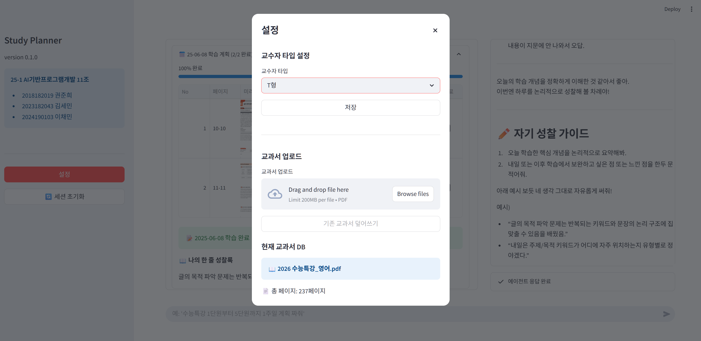
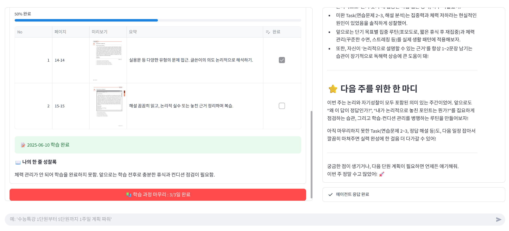
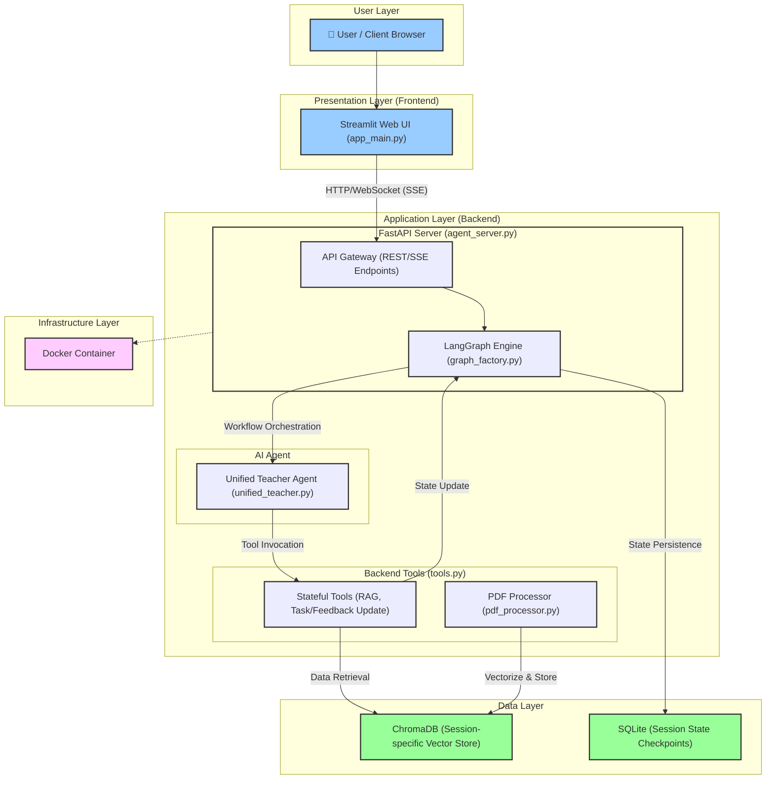
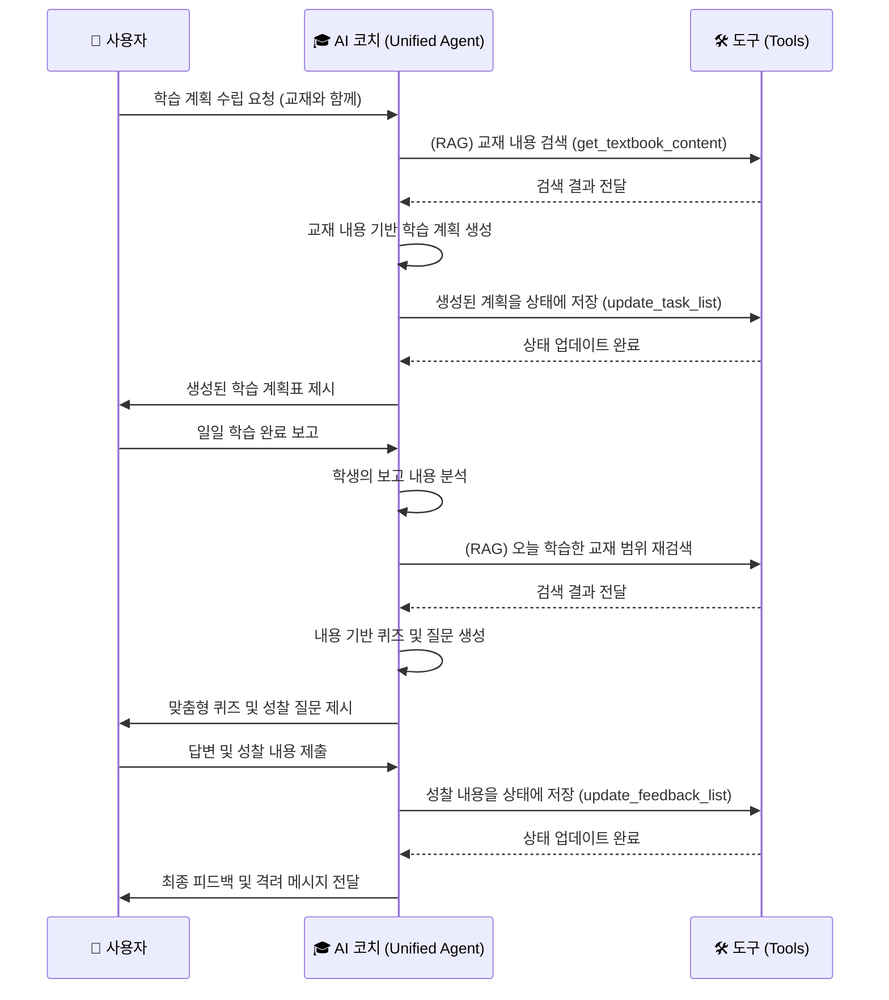
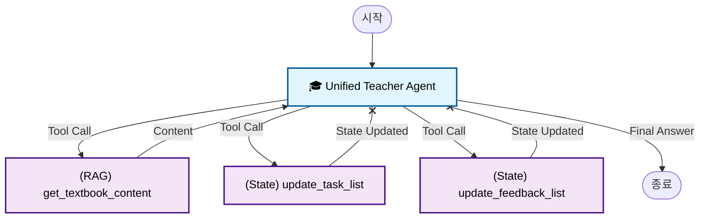
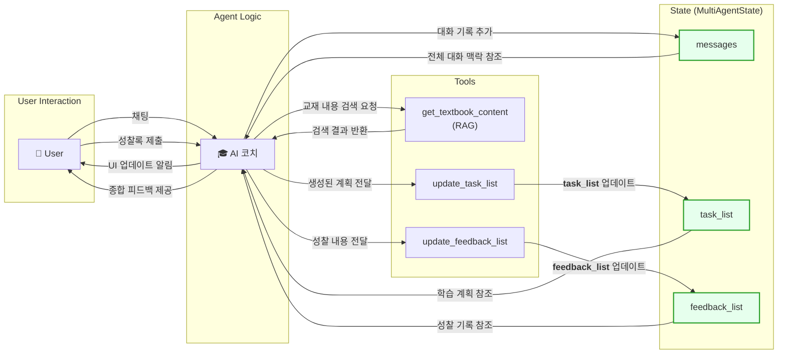
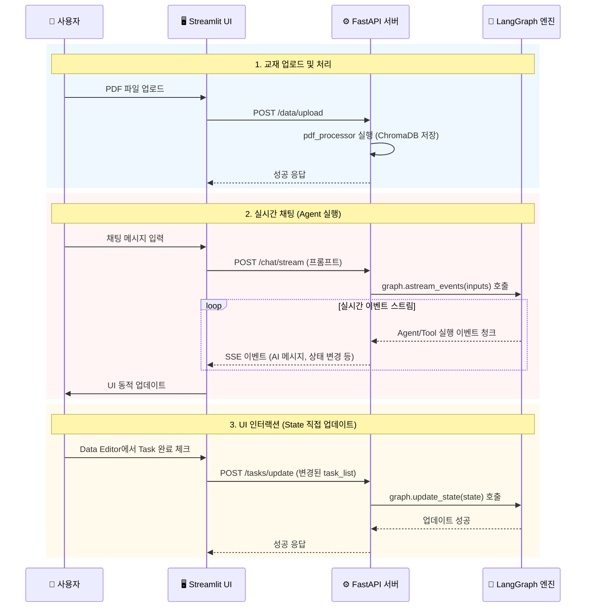
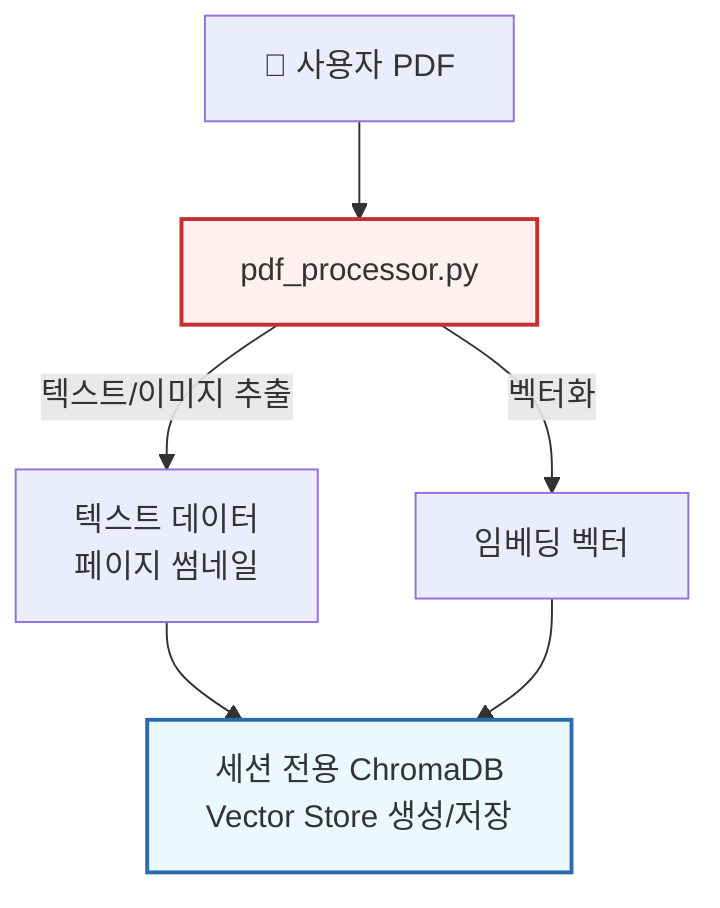
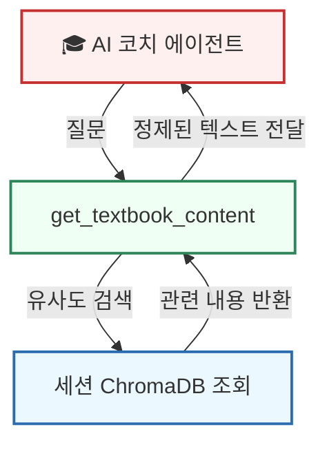

# AI Study Planner
_학생의 교재를 기반으로 상호작용하는 개인 맞춤형 AI 학습 코치_

```
제작자: 권준희, 김세민, 이채민
소속: 연세대학교 교육학과
버전: 1.0.0 (2024.06.04)
- 기능: 개인 교재(PDF) 기반 학습 계획 자동 수립, AI 코치와의 일대일 상호작용, 맞춤형 퀴즈 및 성찰록 관리
- 기술: LangGraph, FastAPI, Streamlit, ChromaDB, Docker
```

<br>

<!-- 데모 앱 링크가 있다면 여기에 추가하세요 -->
<!-- <div align="center">
  <h3> 직접 사용해 보세요 ✨</h3>
  <a href="your-streamlit-app-url" target="_blank">
    
  </a>
  <p><i>버튼을 클릭하면 데모 앱 링크로 이동합니다. 🚀</i></p>
</div> -->
<br>

---

## 1️⃣ 프로젝트 개요

**AI Study Planner**는 사용자가 자신의 학습 교재(PDF)를 업로드하면, AI가 이를 분석하여 개인화된 학습 계획을 자동으로 수립해주는 시스템입니다.

이 시스템은 단순히 계획만 생성하는 것이 아니라, AI가 '학습 코치'로서 매일의 학습 과정을 함께 관리합니다. 학생의 진행 상황에 따라 맞춤형 퀴즈를 제공하거나, 학습 완료 후에는 성찰을 유도하여 학습 내용을 점검할 수 있도록 설계했습니다. 모든 상호작용은 LangGraph와 FastAPI를 기반으로 상태를 저장하는 에이전트 구조로 구현되어, 지속적인 학습 관리가 가능합니다.

---

## 2️⃣ 사용자 경험

### 1. 교재 등록 및 교수자 타입 설정

학생은 PDF 교재를 업로드하고, 논리적 분석 중심의 'T형' 또는 공감/격려 중심의 'F형' 교수자 타입을 선택할 수 있습니다. 교수자 타입에 따라 AI의 피드백 스타일이 달라지며, 학생의 학습 성향에 맞는 맞춤형 코칭이 가능합니다.




### 2. 할 일(Task) 리스트 생성 및 일별 진행상황 공유 & 성찰록 작성

AI는 교재 내용을 분석하여 일별 학습 계획(Task 리스트)을 자동으로 생성합니다. 각 Task는 실제 교재 페이지와 연동되어, 미리보기 이미지를 통해 학습 범위를 직관적으로 확인할 수 있습니다. 학생이 학습을 완료하면, AI는 해당 Task에 대한 복습 퀴즈를 출제하고, 완료하지 못한 계획이 있으면 그 이유를 묻고 계획을 수정할 수 있도록 안내합니다. 학생의 답변과 성찰 내용은 자동으로 기록되어, 자기주도적 학습과 메타인지 향상을 지원합니다.


### 3. 주간 학습 일정 마무리 및 종합 피드백

모든 학습 계획에 대한 성찰록이 작성되면, '학습 과정 마무리' 버튼이 활성화됩니다. 이 버튼을 누르면, AI가 그동안 작성된 성찰록과 학습 데이터를 종합하여 주간 학습 내용을 정리하고, 학생의 학습 패턴과 개선점을 분석한 종합 피드백을 제공합니다.



---

## 4️⃣ 프로젝트 아키텍처

### A. 프로젝트 구조

```
aied/
├── backend/                    # 백엔드 (FastAPI, LangGraph)
│   ├── agent_server.py         # FastAPI 메인 서버
│   ├── graph_factory.py        # LangGraph 워크플로우 정의
│   ├── tools.py                # AI 에이전트 도구 (RAG, 상태 업데이트)
│   ├── pdf_processor.py        # PDF 처리 및 벡터화, 썸네일 생성
│   ├── agents_prompt/          # 에이전트 시스템 프롬프트
│   ├── DB/                     # 데이터베이스
│   │   ├── checkpointer/       # LangGraph 세션 체크포인트 (SQLite)
│   │   └── textbook/           # ChromaDB 교재 벡터 저장소
│   ├── Dockerfile              # Docker 컨테이너 설정
│   └── requirements.txt        # Python 의존성
└── frontend/                   # 프론트엔드 (Streamlit)
    ├── app_main.py             # Streamlit 메인 앱
    └── requirements.txt        # Python 의존성
```

### B. 시스템 아키텍처



---

## 5️⃣ 작업 워크플로우



---

## 6️⃣ LangGraph & FastAPI 구현

이 프로젝트에서는 LangGraph의 상태 관리 기능과 FastAPI의 비동기 통신 기능을 결합하여, 사용자와 지속적으로 상호작용하는 Stateful AI 애플리케이션을 구현했습니다.

### A. LangGraph

여러 에이전트가 복잡하게 분산되는 구조 대신, 모든 로직을 하나의 단일 에이전트(`Unified Teacher Agent`)에 집중하는 방식을 채택했습니다. 이를 통해 관리 포인트를 줄이고, 상태 일관성 문제를 예방할 수 있었습니다.



**1. 상태 정의 (State - `model_config.py`)**  
에이전트의 모든 기억과 작업 내용은 `MultiAgentState`라는 `TypedDict` 모델에 저장합니다. 이를 통해 에이전트는 대화의 맥락, 전체 학습 계획(`task_list`), 학생의 성찰록(`feedback_list`), 교수자 타입(`professor_type`) 등을 세션 내내 추적할 수 있습니다.

```python
# aied/backend/model_config.py
from typing import Annotated, List, TypedDict
from langchain_core.messages import BaseMessage

# 학생의 일일 학습 과업 구조
class Task(TypedDict):
    task_name: str      # 학습할 내용 (e.g., "1단원 집합의 연산")
    pages: List[int]    # 관련 교재 페이지
    completed: bool     # 완료 여부
    summary: str        # AI가 생성한 페이지 요약
    task_id: int        # 고유 ID

# 학생의 성찰 기록 구조
class Feedback(TypedDict):
    task_id: int        # 연결된 Task의 ID
    question: str       # AI가 던진 질문
    answer: str         # 학생의 답변
    feedback: str       # AI의 최종 피드백

# LangGraph의 메인 상태 객체
class MultiAgentState(TypedDict):
    messages: Annotated[List[BaseMessage], lambda x, y: x + y] # 대화 기록
    task_list: List[Task]           # 전체 학습 계획 리스트
    feedback_list: List[Feedback]   # 학생 피드백 리스트
    professor_type: str             # AI 코치 타입 ('T' 또는 'F')
```

**상태 업데이트 파이프라인**


**2. 상태 지속성 (Checkpointer)**  
LangGraph의 `AsyncSqliteSaver`를 사용하여 각 사용자 세션의 `MultiAgentState`를 고유한 SQLite 파일에 저장합니다. 사용자가 브라우저를 새로고침하거나 재접속해도 대화 내용과 학습 계획이 유지되도록 했습니다.

### B. FastAPI: 비동기 에이전트 서버

FastAPI는 비동기 처리를 지원하여 LangGraph 에이전트와 Streamlit 프론트엔드 간의 효율적인 통신을 담당합니다.

**FastAPI 통신 워크플로우**


**1. 세션 기반 리소스 관리**
사용자가 처음 접속하면 고유한 `session_id`가 발급됩니다. 백엔드는 이 ID를 기반으로 해당 사용자의 LangGraph 인스턴스, SQLite 체크포인터 DB 연결, ChromaDB 벡터 저장소 경로를 모두 관리합니다. 여러 사용자가 동시에 접속해도 각자의 세션이 독립적으로 유지됩니다.

**2. 실시간 양방향 통신 (SSE & REST API)**
-   **`/chat/stream` (SSE)**: 에이전트의 응답을 실시간으로 프론트엔드에 스트리밍합니다. AI 메시지뿐만 아니라, 'task_update'와 같은 커스텀 이벤트를 전송하여 학습 계획표가 변경되었음을 프론트엔드에 알리고 `st.rerun()`을 트리거하는 등 동적인 UI 업데이트를 구현했습니다.
-   **`/data/upload` (REST)**: 사용자가 업로드한 PDF 파일을 받아 `pdf_processor`를 실행시키고, 세션 전용 벡터 저장소를 생성하는 엔드포인트입니다.
-   **`/tasks/update` (REST)**: Streamlit의 `st.data_editor`에서 사용자가 체크박스를 클릭하는 등의 UI 인터랙션을 감지하면, 이 API를 통해 LangGraph의 State(`task_list`)를 직접 업데이트합니다. 이를 통해 UI의 변경 사항이 AI 에이전트의 상태와 즉시 동기화됩니다.

```python
# aied/backend/agent_server.py - SSE 스트리밍 엔드포인트 예시
@app.post("/chat/stream")
async def stream_agent_response(req: ChatRequest):
    """SSE 엔드포인트: 에이전트의 응답을 실시간으로 스트리밍합니다."""
    async def event_stream():
        graph = await get_graph_for_session(req.session_id)
        config = {"configurable": {"thread_id": req.session_id}}
        inputs = {"messages": [HumanMessage(content=req.prompt)]}
        
        async for chunk in graph.astream_events(inputs, config, version="v2"):
            kind = chunk["event"]
            if kind == "on_chain_end" and chunk["name"] == "agent":
                # AI 메시지 스트리밍
                content = chunk["data"]["output"]["messages"][-1].content
                yield f"data: {json.dumps({'content': content, 'type': 'ai_message'})}\n\n"
            elif kind == "on_tool_end":
                # 도구 실행 결과에서 커스텀 이벤트 감지
                tool_output = chunk["data"]["output"]
                if "task_update" in str(tool_output): # 'task_update' 문자열 확인
                    yield f"data: {json.dumps({'type': 'task_update'})}\n\n"

    return StreamingResponse(event_stream(), media_type="text/event-stream")
```

**3. 비동기 처리의 이점**
LangGraph 에이전트가 LLM 응답을 기다리거나 DB 작업을 수행하는 동안에도 서버는 다른 요청을 처리할 수 있습니다. FastAPI의 비동기 설계를 통해 I/O 병목 현상을 줄이고, 여러 사용자가 동시에 접속해도 빠른 응답을 제공할 수 있습니다.

---

## 7️⃣ Tool 구현

에이전트는 도구(Tool)를 사용하여 외부 데이터에 접근하거나, 애플리케이션의 상태를 변경합니다.

### A. 동적 RAG 시스템 (`pdf_processor.py`, `tools.py`)

- **On-the-fly Vector Store**: 사용자가 PDF를 업로드하면, `pdf_processor.py`가 해당 파일을 처리합니다. `PyMuPDF`로 텍스트를 추출하고 `text-embedding-3-large` 모델로 벡터화하여, 세션별로 ChromaDB 벡터 저장소를 생성합니다. 각 페이지의 미리보기 썸네일 이미지는 API를 통해 제공합니다.
- **`get_textbook_content` 도구**: 에이전트는 이 도구를 사용하여 학생의 교재 내용을 조회(RAG)하고, 이를 바탕으로 개인화된 학습 계획과 퀴즈를 생성합니다.

<div style="display: flex; gap: 24px; align-items: flex-start;">
<div style="flex:1;">

**1. 교재 등록 시 (최초 1회)**

</div>
<div style="flex:1;">

**2. 교재 조회 시 (AI 코치 요청)**

</div>
</div>

### B. 상태 제어 도구 (`tools.py`)

에이전트가 정보를 반환하는 것에 그치지 않고, 애플리케이션의 상태를 직접 제어할 수 있도록 설계했습니다.

- **`update_task_list` & `update_feedback_list` 도구**: 이 도구들은 LangGraph의 `Command` 객체를 반환합니다. 이 객체는 에이전트가 `MultiAgentState`를 직접 수정할 수 있도록 하여, 학습 계획이나 성찰록이 즉시 상태에 반영되도록 했습니다. 이를 통해 UI와 상태가 항상 동기화됩니다.

```python
# aied/backend/tools.py - 상태 업데이트 도구 예시
from langchain_core.tools import tool
from langgraph.graph import Command

@tool
def update_task_list(task_list: list) -> Command:
    """학생의 학습 계획(task_list)을 받아 전체 상태(State)를 업데이트합니다."""
    # 에이전트의 응답 메시지를 추가하는 대신, 'task_list' 필드를 직접 수정하는
    # Command 객체를 반환하여 상태를 직접 제어합니다.
    return Command(
        update={"task_list": task_list}
    )

@tool
def get_textbook_content(query: str, session_id: str) -> str:
    """학생의 교재 내용에서 관련 정보를 검색(RAG)합니다."""
    # session_id를 기반으로 해당 학생의 ChromaDB 벡터 저장소에 연결
    # ... ChromaDB RAG 로직 ...
    # 검색 결과를 문자열로 반환
    return "검색된 교재 내용..."
```

---

## 8️⃣ 서버 구현 및 배포 구조

이 프로젝트는 Docker와 Github Actions를 활용하여 자동화된 배포 환경을 구축했습니다.

### A. 전체 인프라 개요
- **클라우드 환경**: GCP Compute Engine (Ubuntu, 2vCPU/8GB)
- **배포 방식**: Docker 컨테이너 기반 자동화 배포
- **CI/CD**: Github Actions로 빌드/배포 자동화
- **네트워크**: HTTP/HTTPS 방화벽 오픈, 외부 IP 연결
- **운영**: Supervisor로 프로세스 관리, 장애 자동복구

### B. Docker 기반 배포 구조
- **Dockerfile**: Python, 시스템 라이브러리, 소스 코드, 환경 변수 등 애플리케이션 실행에 필요한 모든 환경을 하나의 이미지로 패키징하여 서버 환경에 구애받지 않는 배포를 지원합니다.
- **docker-compose.yaml**: 컨테이너의 포트 매핑, 볼륨 설정, 재시작 정책 등을 정의하여 `docker-compose up` 명령어로 애플리케이션을 실행하고 관리할 수 있습니다.
- **Supervisor**: 컨테이너 내부에서 FastAPI 서버 프로세스를 모니터링합니다. 서버가 다운되면 Supervisor가 이를 감지하고 자동으로 재시작합니다.

```dockerfile
# aied/backend/Dockerfile
FROM python:3.12-slim
WORKDIR /app

# Supervisor, build-essential 등 시스템 의존성 설치
RUN apt-get update && apt-get install -y --no-install-recommends \
    build-essential supervisor \
    && apt-get clean && rm -rf /var/lib/apt/lists/*

# 파이썬 의존성 설치
COPY requirements.txt .
RUN pip install --no-cache-dir -r requirements.txt

# 소스 코드 복사 및 DB 디렉토리 생성/권한 설정
COPY . .
RUN mkdir -p DB/checkpointer DB/textbook && chmod -R 777 DB

# Supervisor 설정 파일 복사
COPY supervisord.conf /etc/supervisor/conf.d/supervisord.conf

# 포트 노출 및 Supervisor 실행
EXPOSE 8000
CMD ["/usr/bin/supervisord", "-c", "/etc/supervisor/conf.d/supervisord.conf"]
```

### C. Github Actions 기반 CI/CD
- **자동 빌드 및 배포**: `main` 브랜치에 코드가 Push 되면 Github Actions 워크플로우가 실행됩니다.
- **워크플로우**: 코드를 체크아웃하고, SSH를 통해 GCP 서버에 접속한 뒤, 최신 코드를 `git pull` 합니다. 기존 Docker 컨테이너를 내리고 새로운 이미지를 빌드한 뒤 컨테이너를 다시 실행합니다.
- **보안**: SSH 키, 서버 IP, API 키 등 민감한 정보는 Github Secrets에 저장하여 코드 노출 없이 배포 파이프라인을 관리합니다.